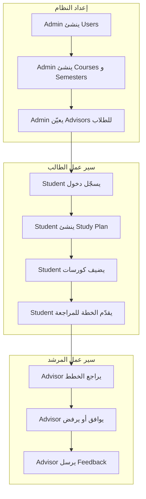

# دليل نظام Cogni-Advisor الشامل

## نظرة عامة

**Cogni-Advisor** هو نظام إرشاد أكاديمي متكامل مصمم لمساعدة الطلاب والمرشدين والإداريين في إدارة العملية الأكاديمية. النظام مبني على **Node.js** و **Express** و **TypeScript** و **PostgreSQL** مع استخدام **Prisma** كـ ORM.

---

## أهداف النظام

1. **إدارة الطلاب**: ملفات شخصية، تتبع أكاديمي، خطط دراسية
2. **الإرشاد الأكاديمي**: ربط الطلاب بالمرشدين، مراجعة الخطط، التواصل
3. **إدارة المنهج**: كورسات، متطلبات سابقة، تسجيل
4. **الإنذار المبكر**: كشف الطلاب المعرضين للخطر
5. **تتبع التخرج**: متطلبات التخرج والتقدير
6. **التحليلات**: أداء أكاديمي، معدلات، توزيع الدرجات

---

## البنية التقنية

### التقنيات الأساسية

| المكون | التقنية |
|--------|---------|
| Runtime | Node.js 20 LTS |
| Framework | Express.js 5 |
| Language | TypeScript 5.9 |
| Database | PostgreSQL 16 |
| ORM | Prisma 6 |
| Authentication | JWT (jsonwebtoken) |
| Validation | Zod 4 |
| Documentation | Swagger/OpenAPI 3.0 |

### هيكل المشروع

```
Cogni-Advisor/
├── prisma/
│   ├── schema.prisma      # تعريف قاعدة البيانات
│   └── migrations/        # سجلات التغييرات
├── src/
│   ├── config/            # إعدادات (DB, logger, swagger)
│   ├── middlewares/       # مصفيات الطلب
│   ├── modules/           # وحدات النظام
│   ├── routes/            # مسارات الجذر
│   ├── utils/             # أدوات مساعدة
│   └── app.ts             # تكوين التطبيق
├── postman/
│   ├── collection.json   # مجموعة Postman
│   └── README.md          # دليل الاختبار
├── docs/                  # التوثيق
└── docs/SYSTEM-GUIDE.md   # هذا الملف
```

---

## الأدوار والصلاحيات

### 1. ADMIN
- إدارة المستخدمين بالكامل (إنشاء، تعديل، حذف)
- إدارة الكورسات، الفصول، السجلات
- إعدادات النظام
- عرض لوحة تحكم شاملة
- إدارة تنبيهات الطلاب
- إدارة متطلبات التخرج

### 2. ADVISOR
- عرض ملف الطلاب المسؤول عنهم
- مراجعة واعتماد الخطط الدراسية
- إرسال feedback للطلاب
- عرض التنبيهات
- إرسال واستقبال الرسائل

### 3. STUDENT
- إدارة الملف الشخصي
- إنشاء وتقديم خطط دراسية
- التسجيل في كورسات
- عرض التوصيات والتحليلات
- تقييم المواد

---

## وحدات النظام (Modules)

### 1. Authentication (`/api/auth`)
- **Login**: تسجيل دخول بـ `identifier` (الرقم الوطني) و `password`
- **Change Password**: تغيير كلمة المرور للمستخدم الحالي

### 2. Users (`/api/users`) - Admin Only
- CRUD كامل للمستخدمين
- إنشاء مستخدمين بأدوار مختلفة
- حذف متسلسل (cascading)

### 3. Students (`/api/students`)
- **الطالب**: الملف الشخصي، الملخص الأكاديمي، التحديث
- **Admin**: عرض/تحديث/إلغاء تفعيل/إعادة تفعيل أي طالب

### 4. Courses (`/api/courses`)
- CRUD للكورسات
- إضافة وحذف المتطلبات السابقة
- إحصائيات المادة (من Reviews)
- حذف prerequisites تلقائياً عند حذف الكورس

### 5. Semesters (`/api/semesters`)
- CRUD للفصول الدراسية
- دعم التواريخ بصيغة `YYYY-MM-DD` و ISO-8601

### 6. Enrollments (`/api/enrollments`)
- تسجيل الطالب في كورس
- تحديد كورس كـ passed (Admin)

### 7. Grades (`/api/grades`)
- تعيين درجات للطلاب

### 8. Study Plans (`/api/study-plan`)
- إنشاء، تقديم، مراجعة الخطط الدراسية
- توصيات AI (للربط لاحقاً)

### 9. Advisor Portal (`/api/advisor`)
- ملف المرشد، لوحة التحكم
- قائمة الطلاب وتفاصيلهم

### 10. Messages (`/api/advisor/messages`)
- إرسال واستقبال الرسائل بين المرشد والطلاب

### 11. Notifications (`/api/notifications`)
- عرض وتحديد حالة القراءة

### 12. Feedback (`/api/feedback`)
- إنشاء feedback من المرشد للطالب
- عرض feedback حسب الطالب أو المرشد

### 13. Semester Records (`/api/semester-records`)
- سجلات الفصول الدراسية (GPA، الساعات المسجلة)

### 14. Admin Portal (`/api/admin`)
- نظرة عامة على النظام
- إعدادات النظام مع audit logging

### 15. AI Module (`/api/ai`) - بنية تحتية
- Chat، Suggest Plan، Predict GPA
- Risk Analysis
- History
- **ملاحظة**: يحفظ الطلبات في DB بـ status PENDING، الربط مع فريق AI لاحقاً

### 16. Alerts (`/api/alerts`) - Early Warning System
- عرض، فحص، حل التنبيهات
- أنواع: LOW_GPA، MISSING_HOURS، OVERLOAD، إلخ

### 17. Graduation (`/api/graduation`)
- نظرة عامة على التخرج
- متطلبات مفصلة
- تدقيق الدرجة
- إنشاء متطلبات (Admin)

### 18. Reviews (`/api/reviews`) - Course Reviews
- إنشاء/تحديث تقييم مادة
- عرض تقييمات مادة أو تقييماتي
- حذف تقييم

### 19. Analytics (`/api/analytics`)
- نظرة عامة، منحنى GPA
- توزيع الدرجات، تقدم الساعات

### 20. Recommendations (`/api/recommendations`)
- توصيات المواد للطالب

### 21. Progress (`/api/progress`)
- تقدم الطالب الأكاديمي مع توزيع GPA

---

## قاعدة البيانات (Schema)

### النماذج الأساسية
- **User**: المستخدم الأساسي (first_name, last_name, national_id, personal_email, ...)
- **Student**: بيانات الطالب (GPA، الساعات، المستوى، الحالة)
- **Advisor**: بيانات المرشد (office_hours, bio)
- **Admin**: بيانات المسؤول

### النماذج الأكاديمية
- **Course**: كورسات مع prerequisites
- **Semester**: فصول دراسية
- **Enrollment**: تسجيل الطالب في كورس
- **StudyPlan**: خطط دراسية
- **SemesterRecord**: سجلات الفصول

### النماذج الجديدة (التحسينات)
- **AIInteraction**: تفاعلات الذكاء الاصطناعي
- **Alert**: تنبيهات إنذار مبكر
- **GraduationRequirement**: متطلبات التخرج
- **GraduationProgress**: تقدم الطالب في المتطلبات
- **CourseReview**: تقييمات المواد

### ما تم إزالته
- **City** - لم يعد مستخدماً
- **Department** - غير ضروري للإرشاد

---

## تدفق العمل النموذجي



---

## المصادقة (Authentication)

1. **تسجيل الدخول**: `POST /api/auth/login`
   - Body: `{ "identifier": "الرقم الوطني 14 رقم", "password": "كلمة المرور" }`
   - Response: `{ "token": "JWT...", "user": { "id", "role", ... } }`

2. **استخدام Token**: إضافة Header
   - `Authorization: Bearer <token>`

3. **صلاحية Token**: 24 ساعة (قابل للتعديل)

---

## التثبيت والتشغيل

### المتطلبات
- Node.js 20+
- PostgreSQL 16+
- npm أو yarn

### الخطوات
```bash
# 1. تثبيت الحزم
npm install

# 2. إعداد البيئة
cp .env.example .env
# تحرير .env بإعدادات قاعدة البيانات

# 3. تطبيق Schema
npx prisma db push
# أو: npx prisma migrate dev

# 4. تشغيل السيرفر
npm run dev
```

السيرفر يعمل افتراضياً على `http://localhost:3000` (أو PORT في .env).

---

## الموارد المفيدة

| المورد | الرابط/الملف |
|--------|---------------|
| Swagger UI | `http://localhost:3000/api-docs` |
| Health Check | `GET /api/health` |
| Postman Collection | `postman/collection.json` |
| دليل الـ Modules الجديدة | `docs/API/NEW-MODULES.md` |
| دليل الاختبار | `docs/API/POSTMAN.md` |

---

## ملاحظات مهمة

### التواريخ
- دعم صيغ: `YYYY-MM-DD` و ISO-8601
- يتم التحويل التلقائي في Semester endpoints

### إنشاء المستخدم
- الحقول المطلوبة: `first_name`, `last_name`, `national_id`, `personal_email`, `password`, `role`
- لا يوجد `city_id` أو `department_id`

### إنشاء الكورس
- الحقول: `course_code`, `course_name`, `credits`
- اختياري: `required_hours_to_take`, `is_available`

### تحديث الطالب (Admin)
- الحقول: `major_type`, `level`, `advisor_id`, `cumulative_gpa`, `total_earned_hours`, `status`
- لا يوجد `total_hours` - استخدم `total_earned_hours`
- لا يوجد `departmentId` - تم حذف Department

---

**آخر تحديث:** 2026-03-01  
**الإصدار:** 3.0
